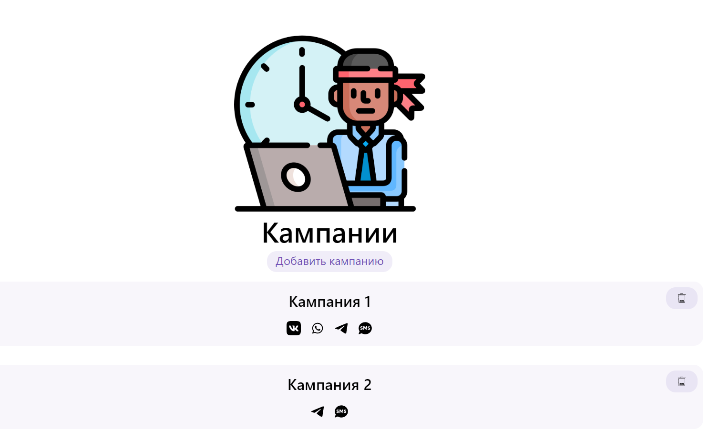

# Тестовое задание
Разрешено использовать любые JavaScript / Node.js фреймворки. Выбор способа хранения данных также остается на Ваше усмотрение. Результат необходимо представить в виде архива с программным кодом или ссылкой на репозиторий.

Предметное описание
Приложение Fromni позволяет пользователям инициировать общение со своими клиентами, отправляя Кампании в различные мессенджеры и социальные сети. Для этого пользователю необходимо указать каналы отправки и настроить сообщение для каждого из них. Помимо текста в некоторых каналах сообщение может содержать клавиатуру с кнопками, позволяющими выбрать один из быстрых ответов или перейти на сторонний веб-сайт.

Техническое задание
Ориентируясь на возможности и ограничения каналов, представленные в таблице ниже, создайте форму, позволяющую:
выбирать каналы, участвующие в Кампании (предположим, что пользователю доступны каналы ВКонтакте, Telegram, WhatsApp, SMS). Учтите, что пользователю не обязательно использовать все каналы, а их порядок может быть любым;
настраивать сообщение для каждого выбранного канала. Для сообщения можно задать текст и клавиатуру с кнопками. В мессенджерах клавиатура может иметь стандартное отображение (показывается под полем ввода в диалоге) или inline-отображение (показывается внутри сообщения), поэтому добавьте переключатель для изменения режима отображения. Учтите, что в зависимости от типа отображения настройки клавиатуры могут отличаться. Кроме этого, кнопки клавиатуры могут быть различных типов:
кнопки с быстрым ответом (при нажатии на них в чат отправляется сообщение от пользователя с текстом кнопки);
кнопки с ссылкой (при нажатии на них в браузере открывается указанный URL).
После завершения настроек у пользователя должна быть возможность сохранить их в БД по нажатию кнопки “Сохранить”. При желании реализуйте полный набор CRUD методов в API.
Сводная таблица по каналам и их возможностям

# Немного про решение

## Как быстро посмотреть?
настроил для этого проекта CI/CD на Heroku => можно посмотреть тут https://message-campaigns.herokuapp.com/

## стек

на клиенте 
- react
- redux

на сервере 

- express
- mysql

мне показалось интерестым, чтобы был предпросмотр сообщения. для этого я сделал компонеты, отображающие интерфейс различных чатов. (далее вьюшки)

делать их с 0 времени не было, поэтому разметку и стили для них позаимствовал с m.vk.com telegram web и проектов на codepen

## Что можно было сделать лучше (не хватило времени)

- реализовать полностью CRUD
- больше заморочиться со стилизацией
- сделать адаптив
- изолировать стили вьюшек чатов. для этого вижу 2 пути
  - выделить их в подпроекты и грузить через iframe и передавать параметры череp post massege
  - (в идеале) сверстать их с 0 с css модулями

## Немного скриншотов

